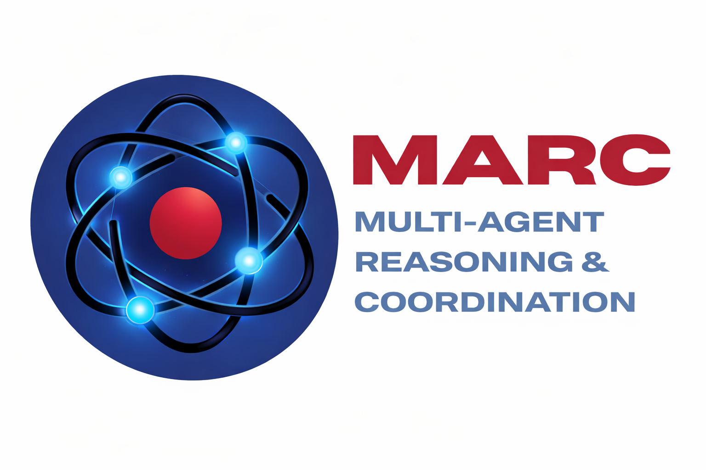

# MARC v1 — Multi-Agent Reasoning and Coordination
[](https://arxiv.org/abs/2608.13476)
[](https://www.python.org/downloads/)
[](https://opensource.org/licenses/MIT)



MARC is a configurable multi-agent framework for clinical reasoning. Instead of asking a single model to extract, reason, and answer in one call, MARC runs a sequence of role-specialized agents that pass context explicitly, so each stage of the reasoning process can be inspected on its own.

Agents, models, prompts, and optional retrieval sources are defined in YAML. Adding, removing, or reordering agents requires no code changes.

The default pipeline runs three agents in sequence. Each receives the original input plus the preceding agent's output. Roles are defined entirely by prompt templates — the labels above illustrate a question-answering configuration.

## Features

- Sequential agent pipeline with explicit context passing between stages.
- YAML-defined agents — name, model, prompt file, and RAG sources per agent.
- Two backends — the Google Gemini API, or local inference via Ollama.
- Per-agent retrieval (RAG) over local text files, using Chroma.
- Decomposer — generates a three-agent pipeline from a plain-language task description.
- Greedy decoding by default (temperature = 0) for repeatable runs.

## Requirements

- Python 3.10–3.13.
- A Google AI Studio API key for the Gemini backend, or a running Ollama server for local inference.

## Installation

```bash
git clone https://github.com/Penn-RAIL/MARC-v1.git
cd MARC-v1

python -m venv .venv
source .venv/bin/activate        # Windows: .venv\Scripts\activate

pip install -e ".[rag]"
```

`pip install -e .` installs the core dependencies only; the `[rag]` extra adds retrieval support (Chroma). Add `[dev]` as well if you're contributing (`pip install -e ".[rag,dev]"`) for tests, linting, and type checking.

Create a `.env` file in the project root:

```
GOOGLE_API_KEY=your_google_api_key_here
```

An `.env.example` is included for reference. `GOOGLE_API_KEY` is required for the Gemini backend; `MARC_BACKEND` and `OLLAMA_BASE_URL` (below) can also be set in `.env` or the shell — both are read at the point each agent is constructed, not at import time, so either location works.

## Quick start

### Gemini backend (default)

```bash
marc run
```

This loads `config/agents.yaml`, builds the pipeline, and starts an interactive prompt. Enter text at the `>>>` prompt; type `exit` to quit. Each agent's output is printed as it runs.

### Ollama backend (local)

```bash
ollama serve
ollama pull <your-model>          # e.g. MedAIBase/MedGemma1.5:4b

export MARC_BACKEND=ollama
marc run
```

One thing to know: `config/agents.yaml`'s `model:` values are Gemini model IDs, which Ollama cannot serve. Setting `MARC_BACKEND=ollama` switches how each agent talks to a model, but an explicit `model:` in the config always wins over the backend's default — so running the *default* config against Ollama as-is will fail with a "model not found" error from Ollama. Either update the `model:` values in `config/agents.yaml` to Ollama tags, or use the Decomposer (below), which generates a config with correct Ollama model names automatically.

Pipeline agents connect to Ollama's default host, `http://localhost:11434`. There is currently no environment override for them — `OLLAMA_BASE_URL` is read by the Decomposer only.

## Configuration

`config/agents.yaml` defines the pipeline. Agents run top to bottom.

```yaml
agents:
  - name: "Agent 1"
    model: "gemini-2.0-flash"
    prompt_file: "agent_1_prompt.txt"
    context_files: []
  - name: "Agent 2"
    model: "gemini-2.0-flash"
    prompt_file: "agent_2_prompt.txt"
    context_files: ["data/knowledge/sample_knowledge.txt"]
  - name: "Agent 3"
    model: "gemini-2.0-flash"
    prompt_file: "agent_3_prompt.txt"
    context_files: []
```

| Key | Required | Description |
|---|---|---|
| `name` | yes | Display name, used in console output. |
| `model` | no | Model identifier. Defaults to `gemini-1.5-flash` (Gemini) or `MedAIBase/MedGemma1.5:4b` (Ollama). |
| `prompt_file` | yes | Filename of a template in `prompts/`. A missing file fails with a clear configuration error before any agent runs — it does not fall back silently. |
| `context_files` | no | Paths to text files to retrieve over. Omit or leave empty to disable RAG for that agent. |
| `temperature` | no | Sampling temperature. Defaults to `0.0`. |
| `num_predict` | no | Max tokens to generate (Ollama only; ignored for Gemini). Defaults to `768`. |
| `num_ctx` | no | Context window size (Ollama only; ignored for Gemini). Defaults to `3072`. |

Models can differ per agent, but the backend is global — `MARC_BACKEND` applies to every agent in a run, so you cannot mix Gemini and Ollama agents in the same pipeline.

The whole config is validated up front (via Pydantic) before any agent is constructed or any external service is called — a missing required field, invalid YAML, or missing prompt file fails immediately with a specific error rather than a stack trace partway through a run.

The three prompts shipped in `prompts/` are a deliberately generic starting point — extract entities, classify, recommend next steps. Replace them with task-specific prompts for real use.

## Writing prompts

Prompt templates are plain text files in `prompts/`. Two variables are substituted at runtime:

| Variable | Value |
|---|---|
| `{input}` | The original user input. Available to every agent. |
| `{previous_agent_output}` | Output of the preceding agent. Empty for the first agent. |

If a template omits `{previous_agent_output}`, the upstream output (and any retrieved RAG context) is appended to the human turn automatically, so context is never silently dropped — this applies regardless of which placeholders a given prompt file actually uses.

Any other curly-brace expression in a prompt is treated as a template variable and will raise an error. Escape literal braces by doubling them: `{{` and `}}`.

Every agent receives `{input}`; each downstream agent additionally receives the preceding agent's output. The `VERDICT = <label>` convention is what the Decomposer generates — the stock prompts in `prompts/` do not use it.

## Retrieval (RAG)

Listing files under an agent's `context_files` builds an in-memory Chroma vector store for that agent. Documents are split into 1000-character chunks, and the retrieved text is passed to the model alongside the upstream output. The store is ephemeral — it is rebuilt on each run.

Embeddings follow the active backend:

| Backend | Embedding model | Setup |
|---|---|---|
| Gemini | `models/gemini-embedding-001` | Uses your `GOOGLE_API_KEY`. |
| Ollama | `nomic-embed-text` | `ollama pull nomic-embed-text` |

## Decomposer

The Decomposer turns a plain-language task description into a complete three-agent pipeline, generating a prompt template for each agent. It runs on Ollama.

```bash
export MARC_BACKEND=ollama
ollama pull gemma4:e4b                      # decomposer model
ollama pull MedAIBase/MedGemma1.5:4b        # pipeline model

marc decompose
```

Describe your task when prompted. The Decomposer writes:

- `prompts/decomposed_agent_1_prompt.txt`, `decomposed_agent_2_prompt.txt`, `decomposed_agent_3_prompt.txt` — a separate namespace from the default `agent_1/2/3_prompt.txt` files, so generating a pipeline never overwrites the default pipeline's prompts
- `config/decomposed_agents.yaml` — the generated pipeline configuration, pointing at the files above

Run the generated pipeline with:

```bash
marc run --config config/decomposed_agents.yaml
```

Model choices are set in `src/marc/decomposer.py` (decomposer model) and `src/marc/config.py`'s `DECOMPOSED_DEFAULT_MODEL` (pipeline agents). See [docs/decomposer.md](docs/decomposer.md) for details.

## Utilities

List the Gemini models available to your API key:

```bash
python scripts/list_models.py
```

This reads `GOOGLE_API_KEY` from `keys.env` or the shell environment.

## Project structure

```
MARC-v1/
├── src/marc/                    # package source
│   ├── cli.py                   # `marc run` / `marc decompose` entry points
│   ├── config.py                # YAML config loading + validation
│   ├── pipeline.py              # GenericAgent, run_pipeline
│   ├── decomposer.py            # DecomposerAgent
│   ├── schemas.py               # Pydantic config models
│   ├── exceptions.py            # ConfigError
│   └── providers/                # google.py, ollama.py, base.py
├── config/
│   ├── agents.yaml               # default pipeline definition
│   └── decomposed_agents.yaml    # generated by `marc decompose`
├── prompts/                      # agent prompt templates
│   └── decomp.txt                # Decomposer system prompt
├── data/
│   └── knowledge/                # text files available for RAG
├── docs/                         # additional documentation
├── scripts/                      # standalone utilities
├── assets/                       # logo and static assets
├── pyproject.toml
├── .env.example
└── README.md
```

## License

Released under the MIT License. See [LICENSE](LICENSE).

**Disclaimer**: MARC is a research framework. It is not a medical device and is not intended for clinical decision-making. Always validate model-generated content before relying on it.
